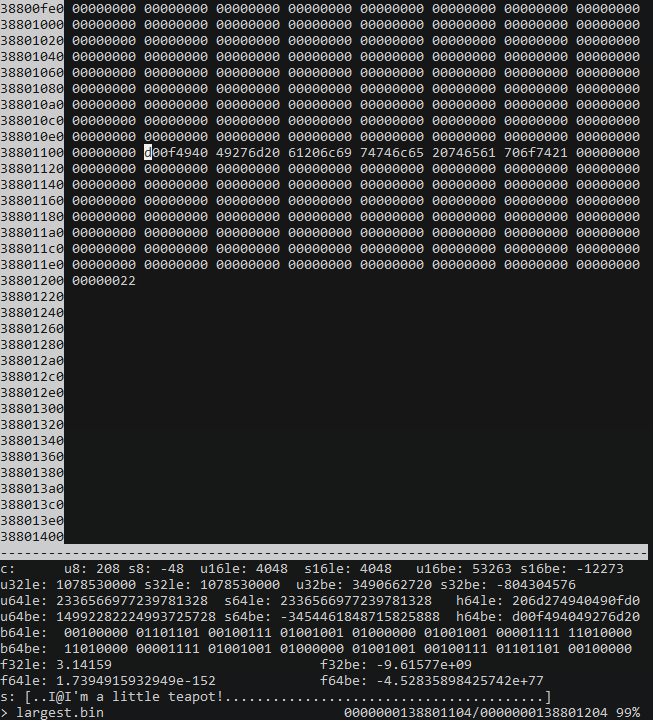

jakhex
======

*jakhex* is a curses based full screen hex editor.



It supports the following **features**:

- curses based full screen interface hex editor
- POSIX C99 with a single dependency on a curses library
- ability to truncate or extend files, including inserting bytes in the middle
- read a file and insert it in the buffer at an arbitrary position
- cursor based navigation
- jump to absolute addresses
- jump to relative offsets from the current cursor position
- shows interpretation of the next few bytes as ints, floats and string
  with both big- and little endianness
- shows a binary stream starting at the current cursor location
- punch in (overwrite) data in hex, ASCII, or full int- and floating point
  numbers with either big- or little endianness
- 26 address registers you can use to save your favourite locations
- region based delete, copy, insert and overwrite commands using a single
  clipboard buffer
- efficiently search both forward and backwards for an arbitrary binary string,
  typed in either in hex or ASCII
- ability to edit large files, to the extent of your patience and RAM.
  I've successfully edited files slightly larger than 4GiB.

It has the following *limitations*:

- its in-memory buffer is stored as a big contiugous array
  * meaning, loading files implies trying to allocate that much memory
  * you can derive from that what kind of file sizes you can load at any time
- the screen width is fixed to 80 columns, 32 bytes per line
  * other hex editors annoy me in that I need to fiddle with the screen size
    to get the line width to align with a round number that's easy to do maths with
  * only the bottom 32bits of addresses are printed in the first column, because I ran out of screen space
- searching doesn't remember what you previously searched for (but you can use
  tmux's/X11's kill buffer to repeatedly paste the same search string)
- the details pane can't be hidden, so you need at least 13 lines of screen
- searching doesn't support patterns nor regular expressions
- region commands always prompt you for a pair of markers
- keys are not rebindable, and the bindings are brain dead. Be sure to print
  out a cheat sheet!
- single buffer only
- any file related commands update the "last mentioned file name" which may not be what you want
- markers are not relocated if you insert bytes before their current address
  (they hold a number which can be used as an absolute address)
- ASCII only; I imagine you're here mostly to look at bits and bytes, possibly
  to diagnose why you have invalid UTF-8 at address 0x145f2200. The only issue
  is with filenames containing non-ASCII or non-printable characters; you can
  symlink your file to ~/link to work around this.
- there are no preferences and no rc files
- while the `g`, `+` and `-` commands accept both dec and hex input, the
  command line invocation only accepts decimal input
- string search limits you to a 2^31-2 long needle, but I hope that doesn't
  bother you. I haven't actually tested with anything longer than what you
  can type off the top of your head, so it's more of a theoretical limit

You can edit a file and jump to offset 0xA000 with

```
jakhex file +40960
```

See `jakhex -h` or `man ./jakhex.1` for more information.

Why does this exist?
====================

Easy: I didn't have a full featured hex editor that was relatively easy and
pain free to set up and use. So I wrote my own that does all the stuff I need.

Building
========

This project depends on some curses library, e.g. `ncurses`, installed as a
system library and system headers.

The code is (or *should* be) conformant to C99 and POSIX, so all you need is
a C99 compiler on a POSIX compatible system. I've only tested on Alpine and
RHEL at the time of writing.

Run

```
make
make install
```

Changes
=======

1.0.1 -> 1.0.2
--------------

- fix bug where the window would scroll too late once hitting the separator

1.0.0 -> 1.0.1
--------------

- Fix bug in `x` (*kill region*) command which would cause a hang / crash
- man page tweaks
- fix warnings reported by `gcc -Wall`
- update Makefile to compile with `-O2` by default
- update README
- add `^G` in normal mode to report file size in a better human readable way
- change reverse search to include the byte you are currently on; this is
  annoying for single byte reverse searches, but it is what you actually want
  for multibyte reverse searches; forward search is unaffected.
- fix display or ridiculously large files; the buffer contents were correct,
  the display wasn't
- fix bug inserting bytes in files larger than 4GB
